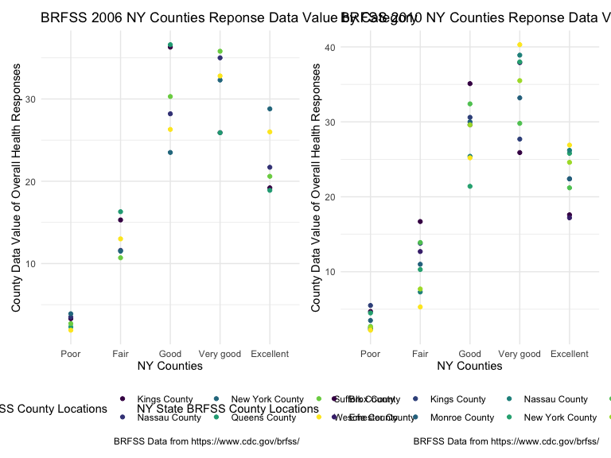

P8105 Homework 3
================
Jake W. Coldiron - jwc2177 -
14 October 2023

> Before we begin, let’s specify document particulars.

``` r
#r setup

library(tidyverse)
```

    ## ── Attaching core tidyverse packages ──────────────────────── tidyverse 2.0.0 ──
    ## ✔ dplyr     1.1.2     ✔ readr     2.1.4
    ## ✔ forcats   1.0.0     ✔ stringr   1.5.0
    ## ✔ ggplot2   3.4.2     ✔ tibble    3.2.1
    ## ✔ lubridate 1.9.2     ✔ tidyr     1.3.0
    ## ✔ purrr     1.0.1     
    ## ── Conflicts ────────────────────────────────────────── tidyverse_conflicts() ──
    ## ✖ dplyr::filter() masks stats::filter()
    ## ✖ dplyr::lag()    masks stats::lag()
    ## ℹ Use the conflicted package (<http://conflicted.r-lib.org/>) to force all conflicts to become errors

``` r
library(ggridges)

library(patchwork)

knitr::opts_chunk$set(
    echo = TRUE,
    warning = FALSE,
    fig.width = 8, 
  fig.height = 6,
  out.width = "90%"
)

theme_set(theme_minimal() + theme(legend.position = "bottom"))

options(
  ggplot2.continuous.colour = "viridis",
  ggplot2.continuous.fill = "viridis"
)

scale_colour_discrete = scale_colour_viridis_d
scale_fill_discrete = scale_fill_viridis_d
```

# I. Problem 1

## i. Data Importation

This problem uses the Instacart data. DO NOT include this dataset in
your local data directory; instead, load the data from the
p8105.datasets using:

> library(p8105.datasets)

> data(“instacart”)

> These files are hosted on Dr. Goldsmith’s github so we need to
> download p8105.datasets from there. We can do so with the following
> code with a few of the following options

``` r
#downloading datatsets directly from github, unevaluated

install.packages("devtools")
devtools::install_github("p8105/p8105.datasets")

#examples 

library(p8105.datasets)

data(nyc_airbnb)
data(rest_inspec)
```

> Let’s presume that we’ve used install_github() function from the
> devtools package in order to install the p8105.dataets library. Now,
> let’s load this library and start pull out the instacart data.

``` r
#instacart data importation
#view(instacart_df)

library(p8105.datasets)

data("instacart")

instacart_df = 
  instacart %>% 
  as_tibble()

instacart_df = 
  instacart_df %>% 
  janitor::clean_names()

instacart_df
```

    ## # A tibble: 1,384,617 × 15
    ##    order_id product_id add_to_cart_order reordered user_id eval_set order_number
    ##       <int>      <int>             <int>     <int>   <int> <chr>           <int>
    ##  1        1      49302                 1         1  112108 train               4
    ##  2        1      11109                 2         1  112108 train               4
    ##  3        1      10246                 3         0  112108 train               4
    ##  4        1      49683                 4         0  112108 train               4
    ##  5        1      43633                 5         1  112108 train               4
    ##  6        1      13176                 6         0  112108 train               4
    ##  7        1      47209                 7         0  112108 train               4
    ##  8        1      22035                 8         1  112108 train               4
    ##  9       36      39612                 1         0   79431 train              23
    ## 10       36      19660                 2         1   79431 train              23
    ## # ℹ 1,384,607 more rows
    ## # ℹ 8 more variables: order_dow <int>, order_hour_of_day <int>,
    ## #   days_since_prior_order <int>, product_name <chr>, aisle_id <int>,
    ## #   department_id <int>, aisle <chr>, department <chr>

## ii. Data Overview

The goal is to do some exploration of this dataset. To that end, write a
short description of the dataset, noting the size and structure of the
data, describing some key variables, and giving illstrative examples of
observations. Then, do or answer the following (commenting on the
results of each):

> This dataset contains 1384617 rows and 15 columns, with each row
> resprenting a single product from an instacart order. Variables
> include identifiers for user, order, and product; the order in which
> each product was added to the cart. There are several order-level
> variables, describing the day and time of the order, and number of
> days since prior order. Then there are several item-specific
> variables, describing the product name (e.g. Yogurt, Avocado),
> department (e.g. dairy and eggs, produce), and aisle (e.g. yogurt,
> fresh fruits), and whether the item has been ordered by this user in
> the past. In total, there are 39123 products found in 131209 orders
> from 131209 distinct users.

## iii. Aisles

How many aisles are there, and which aisles are the most items ordered
from? Make a plot that shows the number of items ordered in each aisle,
limiting this to aisles with more than 10000 items ordered. Arrange
aisles sensibly, and organize your plot so others can read it.

### a) Asile Count

``` r
#aligned aisles
#view(aligned_aisles_df)

asiles_df = 
  
  instacart_df %>% 
  
  count(aisle)

asiles_df
```

    ## # A tibble: 134 × 2
    ##    aisle                      n
    ##    <chr>                  <int>
    ##  1 air fresheners candles  1067
    ##  2 asian foods             7007
    ##  3 baby accessories         306
    ##  4 baby bath body care      328
    ##  5 baby food formula      13198
    ##  6 bakery desserts         1501
    ##  7 baking ingredients     13088
    ##  8 baking supplies decor   1094
    ##  9 beauty                   287
    ## 10 beers coolers           1839
    ## # ℹ 124 more rows

> Thus, there are 134 asiles.

### b) Popular Asiles Data Frame

``` r
#popular aisles data frame
#view(popular_asiles_df)

popular_asiles_df = 
  
  asiles_df %>% 
  
  filter(n > 10000) %>% 
  
  arrange(desc(n))

popular_asiles_df
```

    ## # A tibble: 39 × 2
    ##    aisle                              n
    ##    <chr>                          <int>
    ##  1 fresh vegetables              150609
    ##  2 fresh fruits                  150473
    ##  3 packaged vegetables fruits     78493
    ##  4 yogurt                         55240
    ##  5 packaged cheese                41699
    ##  6 water seltzer sparkling water  36617
    ##  7 milk                           32644
    ##  8 chips pretzels                 31269
    ##  9 soy lactosefree                26240
    ## 10 bread                          23635
    ## # ℹ 29 more rows

``` r
#Verify it worked

tail(popular_asiles_df)
```

    ## # A tibble: 6 × 2
    ##   aisle                  n
    ##   <chr>              <int>
    ## 1 spreads            12102
    ## 2 canned meals beans 11774
    ## 3 candy chocolate    11453
    ## 4 dry pasta          11298
    ## 5 oils vinegars      10620
    ## 6 butter             10575

> Thus, there are 39 asiles with more than 10,000 orders.

### C) Popular Asiles Plot

``` r
#popular asiles plot
#view(popular_asiles_plot)

popular_asiles_plot = 
  
  popular_asiles_df %>% 
  
  mutate(aisle = fct_reorder(aisle, n)) %>% 
  
  ggplot(aes(x = aisle, y = n, color = aisle)) + 
  
  geom_point() + 
  
  labs(
    title = "Number of Items Ordered From Each Instacart Aisle",
    x = "Asile(s)",
    y = "Number of Items Ordered",
    caption = "Instacart data from: https://www.instacart.com/datasets/grocery-shopping-2017"
    ) + 
  
    scale_y_continuous(
    breaks = c(10000, 20000, 30000, 40000, 50000, 60000, 70000, 80000, 90000, 100000, 110000, 120000, 130000, 140000, 150000, 160000)
  ) +
  
  theme(axis.text.x = element_text(angle = 60, hjust = 1)) +
  
  theme(legend.position = "none")

popular_asiles_plot
```


## iv. Popular Items

Make a table showing the three most popular items in each of the aisles
“baking ingredients”, “dog food care”, and “packaged vegetables fruits”.
Include the number of times each item is ordered in your table.

``` r
# three top popular aisles
# view(three_top_popular_aisles)

three_top_popular_aisles = 
  
  instacart_df %>% 
  
  filter(aisle %in% c("baking ingredients", "dog food care", "packaged vegetables fruits")) |>
  
  group_by(aisle) %>% 
  
  count(product_name) %>%  
  
  mutate(rank = min_rank(desc(n))) %>%  
  
  filter(rank < 4) %>% 
  
  arrange(desc(n))

three_top_popular_aisles
```

    ## # A tibble: 9 × 4
    ## # Groups:   aisle [3]
    ##   aisle                      product_name                                n  rank
    ##   <chr>                      <chr>                                   <int> <int>
    ## 1 packaged vegetables fruits Organic Baby Spinach                     9784     1
    ## 2 packaged vegetables fruits Organic Raspberries                      5546     2
    ## 3 packaged vegetables fruits Organic Blueberries                      4966     3
    ## 4 baking ingredients         Light Brown Sugar                         499     1
    ## 5 baking ingredients         Pure Baking Soda                          387     2
    ## 6 baking ingredients         Cane Sugar                                336     3
    ## 7 dog food care              Snack Sticks Chicken & Rice Recipe Dog…    30     1
    ## 8 dog food care              Organix Chicken & Brown Rice Recipe        28     2
    ## 9 dog food care              Small Dog Biscuits                         26     3

## v. Apples and Ice Cream

Make a table showing the mean hour of the day at which Pink Lady Apples
and Coffee Ice Cream are ordered on each day of the week; format this
table for human readers (i.e. produce a 2 x 7 table).

``` r
#time pink lady apples coffee ice cream
#view(time_pinkladyapples_coffeeicecream)

time_pinkladyapples_coffeeicecream_df = 
  
  instacart_df %>% 
  
  filter(product_name %in% c("Pink Lady Apples", "Coffee Ice Cream")) %>% 
  
  group_by(product_name, order_dow) %>% 
  
  summarize(mean_hour = mean(order_hour_of_day)) %>% 
  
  pivot_wider(
    names_from = order_dow, 
    values_from = mean_hour
  )
```

    ## `summarise()` has grouped output by 'product_name'. You can override using the
    ## `.groups` argument.

``` r
time_pinkladyapples_coffeeicecream_df
```

    ## # A tibble: 2 × 8
    ## # Groups:   product_name [2]
    ##   product_name       `0`   `1`   `2`   `3`   `4`   `5`   `6`
    ##   <chr>            <dbl> <dbl> <dbl> <dbl> <dbl> <dbl> <dbl>
    ## 1 Coffee Ice Cream  13.8  14.3  15.4  15.3  15.2  12.3  13.8
    ## 2 Pink Lady Apples  13.4  11.4  11.7  14.2  11.6  12.8  11.9

# II. Problem 2

## i. Data Importation

This problem uses the BRFSS data. DO NOT include this dataset in your
local data directory; instead, load the data from the p8105.datasets
package.

> library(p8105.datasets)

> data(“brfss_smart2010”)

Because we’ve already loaded the

``` r
#instacart data importation
#view(brfss_df)

library(p8105.datasets)

data("brfss_smart2010")

brfss_df = 
  brfss_smart2010 %>% 
  as_tibble()

brfss_df
```

    ## # A tibble: 134,203 × 23
    ##     Year Locationabbr Locationdesc     Class Topic Question Response Sample_Size
    ##    <int> <chr>        <chr>            <chr> <chr> <chr>    <chr>          <int>
    ##  1  2010 AL           AL - Jefferson … Heal… Over… How is … Excelle…          94
    ##  2  2010 AL           AL - Jefferson … Heal… Over… How is … Very go…         148
    ##  3  2010 AL           AL - Jefferson … Heal… Over… How is … Good             208
    ##  4  2010 AL           AL - Jefferson … Heal… Over… How is … Fair             107
    ##  5  2010 AL           AL - Jefferson … Heal… Over… How is … Poor              45
    ##  6  2010 AL           AL - Jefferson … Heal… Fair… Health … Good or…         450
    ##  7  2010 AL           AL - Jefferson … Heal… Fair… Health … Fair or…         152
    ##  8  2010 AL           AL - Jefferson … Heal… Heal… Do you … Yes              524
    ##  9  2010 AL           AL - Jefferson … Heal… Heal… Do you … No                77
    ## 10  2010 AL           AL - Jefferson … Heal… Unde… Adults … Yes              316
    ## # ℹ 134,193 more rows
    ## # ℹ 15 more variables: Data_value <dbl>, Confidence_limit_Low <dbl>,
    ## #   Confidence_limit_High <dbl>, Display_order <int>, Data_value_unit <chr>,
    ## #   Data_value_type <chr>, Data_Value_Footnote_Symbol <chr>,
    ## #   Data_Value_Footnote <chr>, DataSource <chr>, ClassId <chr>, TopicId <chr>,
    ## #   LocationID <chr>, QuestionID <chr>, RESPID <chr>, GeoLocation <chr>

## ii. Data Tidying

First, do some data cleaning:

1.  format the data to use appropriate variable names;
2.  focus on the “Overall Health” topic
3.  include only responses from “Excellent” to “Poor”
4.  organize responses as a factor taking levels ordered from “Poor” to
    “Excellent”

``` r
#instacart data importation
#view(brfss_df_tidyd)

brfss_df_tidyd = 
  
  brfss_df %>% 
  
  janitor::clean_names() %>% 
  
  filter(topic == "Overall Health") %>%  
  
#The the only possible responses for "response" is Excellent, Very Good, Good, Fair, and Poor. Therefore, no other filtering needs to take place here. 

  arrange(match(response, c("Poor", "Fair", "Good", "Very good", "Excellent")))
  
#Verify everything worked.

brfss_df_tidyd
```

    ## # A tibble: 10,625 × 23
    ##     year locationabbr locationdesc     class topic question response sample_size
    ##    <int> <chr>        <chr>            <chr> <chr> <chr>    <chr>          <int>
    ##  1  2010 AL           AL - Jefferson … Heal… Over… How is … Poor              45
    ##  2  2010 AL           AL - Mobile Cou… Heal… Over… How is … Poor              66
    ##  3  2010 AL           AL - Tuscaloosa… Heal… Over… How is … Poor              35
    ##  4  2010 AZ           AZ - Maricopa C… Heal… Over… How is … Poor              62
    ##  5  2010 AZ           AZ - Pima County Heal… Over… How is … Poor              49
    ##  6  2010 AZ           AZ - Pinal Coun… Heal… Over… How is … Poor              30
    ##  7  2010 AR           AR - Benton Cou… Heal… Over… How is … Poor              21
    ##  8  2010 AR           AR - Pulaski Co… Heal… Over… How is … Poor              36
    ##  9  2010 AR           AR - Washington… Heal… Over… How is … Poor              16
    ## 10  2010 CA           CA - Alameda Co… Heal… Over… How is … Poor              23
    ## # ℹ 10,615 more rows
    ## # ℹ 15 more variables: data_value <dbl>, confidence_limit_low <dbl>,
    ## #   confidence_limit_high <dbl>, display_order <int>, data_value_unit <chr>,
    ## #   data_value_type <chr>, data_value_footnote_symbol <chr>,
    ## #   data_value_footnote <chr>, data_source <chr>, class_id <chr>,
    ## #   topic_id <chr>, location_id <chr>, question_id <chr>, respid <chr>,
    ## #   geo_location <chr>

``` r
tail(brfss_df_tidyd)
```

    ## # A tibble: 6 × 23
    ##    year locationabbr locationdesc      class topic question response sample_size
    ##   <int> <chr>        <chr>             <chr> <chr> <chr>    <chr>          <int>
    ## 1  2002 WA           WA - King County  Heal… Over… How is … Excelle…         323
    ## 2  2002 WA           WA - Pierce Coun… Heal… Over… How is … Excelle…         106
    ## 3  2002 WA           WA - Snohomish C… Heal… Over… How is … Excelle…          92
    ## 4  2002 WV           WV - Kanawha Cou… Heal… Over… How is … Excelle…          62
    ## 5  2002 WI           WI - Milwaukee C… Heal… Over… How is … Excelle…         202
    ## 6  2002 WY           WY - Laramie Cou… Heal… Over… How is … Excelle…         139
    ## # ℹ 15 more variables: data_value <dbl>, confidence_limit_low <dbl>,
    ## #   confidence_limit_high <dbl>, display_order <int>, data_value_unit <chr>,
    ## #   data_value_type <chr>, data_value_footnote_symbol <chr>,
    ## #   data_value_footnote <chr>, data_source <chr>, class_id <chr>,
    ## #   topic_id <chr>, location_id <chr>, question_id <chr>, respid <chr>,
    ## #   geo_location <chr>

## iii. Key Observations

Using this dataset, do or answer the following (commenting on the
results of each):

### 1. In 2002, which states were observed at 7 or more locations? What about in 2010?

#### a) 2002

``` r
#view(brfss_df_tidyd_2002)

brfss_df_tidyd_2002 =
  
  brfss_df_tidyd %>% 
  
  filter(year == "2002") %>%  
  
  rename(state = locationabbr) %>% 
  
  group_by(state) %>% 
  
  summarize(count = n()) %>% 
  
  filter(count >= 7)


brfss_df_tidyd_2002
```

    ## # A tibble: 36 × 2
    ##    state count
    ##    <chr> <int>
    ##  1 AZ       10
    ##  2 CO       20
    ##  3 CT       35
    ##  4 DE       15
    ##  5 FL       35
    ##  6 GA       15
    ##  7 HI       20
    ##  8 ID       10
    ##  9 IL       15
    ## 10 IN       10
    ## # ℹ 26 more rows

> Thus, in 2002, 36 states had 7 or more observations.

#### b) 2010

``` r
#2010 observations
#view(brfss_df_tidyd_2010)

brfss_df_tidyd_2010 =
  
  brfss_df_tidyd %>% 
  
  filter(year == "2010")  %>%  
  
  rename(state = locationabbr) %>% 
  
  group_by(state) %>% 

  count(state) %>% 
  
  filter(n >= 7)
  
brfss_df_tidyd_2010
```

    ## # A tibble: 45 × 2
    ## # Groups:   state [45]
    ##    state     n
    ##    <chr> <int>
    ##  1 AL       15
    ##  2 AR       15
    ##  3 AZ       15
    ##  4 CA       60
    ##  5 CO       35
    ##  6 CT       25
    ##  7 DE       15
    ##  8 FL      205
    ##  9 GA       20
    ## 10 HI       20
    ## # ℹ 35 more rows

> Thus, in 2010, 45 states had 7 or more observations

### 2. Construct a dataset that is limited to Excellent responses, and contains, year, state, and a variable that averages the data_value across locations within a state. Make a “spaghetti” plot of this average value over time within a state (that is, make a plot showing a line for each state across years – the geom_line geometry and group aesthetic will help).

> First, let’s create a spagehetti_df which we will use to bulid the
> plots.

``` r
#spagehetti data frame
#view(brfss_df_tidyd_spagehetti_df)

brfss_df_tidyd_spagehetti_df = 
  
  brfss_df_tidyd %>% 
  
  filter(response == "Excellent") %>% 
  
  rename(state = locationabbr) %>% 
  
  select(year, state, response, data_value) %>% 
  
  group_by(year, state, response) %>% 
  
  summarize(mean_state_value = mean(data_value, na.rm = TRUE))
```

    ## `summarise()` has grouped output by 'year', 'state'. You can override using the
    ## `.groups` argument.

``` r
#Verify it worked

brfss_df_tidyd_spagehetti_df
```

    ## # A tibble: 443 × 4
    ## # Groups:   year, state [443]
    ##     year state response  mean_state_value
    ##    <int> <chr> <chr>                <dbl>
    ##  1  2002 AK    Excellent             27.9
    ##  2  2002 AL    Excellent             18.5
    ##  3  2002 AR    Excellent             24.1
    ##  4  2002 AZ    Excellent             24.1
    ##  5  2002 CA    Excellent             22.7
    ##  6  2002 CO    Excellent             23.1
    ##  7  2002 CT    Excellent             29.1
    ##  8  2002 DC    Excellent             29.3
    ##  9  2002 DE    Excellent             20.9
    ## 10  2002 FL    Excellent             25.7
    ## # ℹ 433 more rows

``` r
tail(brfss_df_tidyd_spagehetti_df )
```

    ## # A tibble: 6 × 4
    ## # Groups:   year, state [6]
    ##    year state response  mean_state_value
    ##   <int> <chr> <chr>                <dbl>
    ## 1  2010 UT    Excellent             27.8
    ## 2  2010 VT    Excellent             23.5
    ## 3  2010 WA    Excellent             19.7
    ## 4  2010 WI    Excellent             21.5
    ## 5  2010 WV    Excellent             16.8
    ## 6  2010 WY    Excellent             21.0

> Let’s look that the graph without “spagehetti” lines first.

``` r
#meatball plot
#view(meatball plot)

brfss_df_tidyd_meatball_plot = 
  
  brfss_df_tidyd_spagehetti_df %>% 
  
  ggplot(aes(x = year, y = mean_state_value, color = state)) +
  
  geom_point(alpha = 0.6) +
  
  labs(
    title = "Cross-Sectional Values of 'Excellent' Overall Health Reponses within the BRFSS Survey from 2002 - 2010 by State",
    x = "Time, in Years",
    y = "State Data Value of Excellent Responses, Averaged from All State Locations", 
    color = "US States plus DC",
    caption = "BRFSS Data from https://www.cdc.gov/brfss/"
  ) +

  scale_x_continuous(
    breaks = c(2002, 2003, 2004, 2005, 2006, 2007, 2008, 2009, 2010),
    labels = c("2002", "2003", "2004", "2005", "2006", "2007", "2008", "2009", "2010")
  )


brfss_df_tidyd_meatball_plot
```


> Based on the given data, we can send that as the years go on, the
> Excellent values tend to decrease. Further, as expected, most data is
> concentrated towards the top with a few notable outliers falling well
> below the group.

> Now let’s add some lines to better understand trends, and make more
> sense from the visual noise.

``` r
#spagehetti and meatball plot
#view(brfss_df_tidyd_spagehetti_meatball_plot)

brfss_df_tidyd_spagehetti_meatball_plot = 
  
  brfss_df_tidyd_spagehetti_df %>% 
  
  ggplot(aes(x = year, y = mean_state_value, color = state)) +
  
  geom_point(alpha = 0.6) +
  
  geom_line(alpha = 0.4) +
  
  labs(
    title = "Trends of 'Excellent' Overall Health Reponses within the BRFSS Survey from 2002 - 2010 by State",
    x = "Time, in Years",
    y = "State Data Value of Excellent Responses, Averaged from All State Locations", 
    color = "US States plus DC",
    caption = "BRFSS Data from https://www.cdc.gov/brfss/"
  ) +

  scale_x_continuous(
    breaks = c(2002, 2003, 2004, 2005, 2006, 2007, 2008, 2009, 2010),
    labels = c("2002", "2003", "2004", "2005", "2006", "2007", "2008", "2009", "2010")
  )

brfss_df_tidyd_spagehetti_meatball_plot
```


> By adding lines, we can see that the variance between years is rather
> stark. Instead of one cluster of data contiuning through time, the
> individual states are all changing but changing in such a way that the
> group remains the same.

> In essence, we’re looking at the central limit theorem in action.
> There are a few outliers every year, and even though the states (i.e.,
> samples) might be far from the measures of central tendency, the
> nation (i.e., population) remains relatively constant.

> We can better look at the trend of each state by faceting the plot.
> It’s a bit difficult to read if it’s small, but you can still see the
> general trend for each state.

``` r
#spagehetti and meatball state plot
#view(brfss_df_tidyd_spagehetti_meatball_state_plot)

brfss_df_tidyd_spagehetti_meatball_state_plot = 
  
  brfss_df_tidyd_spagehetti_df %>% 
  
  ggplot(aes(x = year, y = mean_state_value, color = state)) +
  
  geom_point(alpha = 0.6) +
  
  geom_line(alpha = 0.4) +
  
  facet_grid(. ~ state) +
  
  labs(
    title = "Trends of 'Excellent' Overall Health Reponses within the BRFSS Survey from 2002 - 2010, Partitioned State",
    x = "Time, in Years",
    y = "State Data Value of Excellent Responses, Averaged from All State Locations", 
    color = "US States plus DC",
    caption = "BRFSS Data from https://www.cdc.gov/brfss/"
  )

brfss_df_tidyd_spagehetti_meatball_state_plot
```

    ## `geom_line()`: Each group consists of only one observation.
    ## ℹ Do you need to adjust the group aesthetic?


> Breaking this down by state reveals what most public health officals
> already understand. Wealthier states and territoies like DC generally
> report a high score with little variance. Conversely, poorer states
> like West Virgina report poorer health scores.

> Interestlingly, the more agricultral a state is the more it tends to
> vary. For example, IA, AL, IN, NE all - by inspection - have some the
> the largest between group and between year movements. Then states that
> rely on other industries for their agricultre such as VT, DE, and MN
> generally habe less variaence.

### 3. Make a two-panel plot showing, for the years 2006, and 2010, distribution of data_value for responses (“Poor” to “Excellent”) among locations in NY State.

#### a) 2006 Dataframe

``` r
#ny data distribution 2006 dataframe
#view(brfss_df_tidyd_data_distribution_2006_df)

brfss_df_tidyd_data_distribution_2006_df = 
  
  brfss_df_tidyd %>% 
  
  rename(state = locationabbr) %>% 
  
  rename(county = locationdesc) %>% 
  
  select(year, state, county, response, data_value) %>% 
  
  filter(state == "NY") %>% 
  
  filter(year == 2006) %>% 
  
  mutate(county = recode(county, "NY - Kings County" = "Kings County", "NY - New York County" = "New York County", "NY - Suffolk County" = "Suffolk County", "NY - Nassau County" = "Nassau County", "NY - Queens County" = "Queens County", "NY - Westchester County" = "Weschester County"))

brfss_df_tidyd_data_distribution_2006_df
```

    ## # A tibble: 30 × 5
    ##     year state county            response data_value
    ##    <int> <chr> <chr>             <chr>         <dbl>
    ##  1  2006 NY    Kings County      Poor            3.3
    ##  2  2006 NY    Nassau County     Poor            3.5
    ##  3  2006 NY    New York County   Poor            3.9
    ##  4  2006 NY    Queens County     Poor            2.3
    ##  5  2006 NY    Suffolk County    Poor            2.7
    ##  6  2006 NY    Weschester County Poor            1.9
    ##  7  2006 NY    Kings County      Fair           15.3
    ##  8  2006 NY    Nassau County     Fair           11.6
    ##  9  2006 NY    New York County   Fair           11.5
    ## 10  2006 NY    Queens County     Fair           16.3
    ## # ℹ 20 more rows

#### b) 2006 Plot

``` r
#ny data distribution 2006 plot
#view(brfss_df_tidyd_data_distribution_2006_plot)

brfss_df_tidyd_data_distribution_2006_plot = 
  
  brfss_df_tidyd_data_distribution_2006_df %>% 
  
  mutate(response = fct_relevel(response,"Poor", "Fair", "Good", "Very good", "Excellent")) %>% 
  
  ggplot(aes(x = response, y = data_value, color = county)) +
  
  geom_point() +
  
  labs(
    title = "BRFSS 2006 NY Counties Reponse Data Value by Category",
    x = "NY Counties",
    y = "County Data Value of Overall Health Responses", 
    color = "NY State BRFSS County Locations",
    caption = "BRFSS Data from https://www.cdc.gov/brfss/"
  )
  
brfss_df_tidyd_data_distribution_2006_plot
```


#### c) 2010 Dataframe

``` r
#ny data distribution 2010 dataframe
#view(brfss_df_tidyd_data_distribution_2010_df)

brfss_df_tidyd_data_distribution_2010_df = 
  
  brfss_df_tidyd %>% 
  
  rename(state = locationabbr) %>% 
  
  rename(county = locationdesc) %>% 
  
  select(year, state, county, response, data_value) %>% 
  
  filter(state == "NY") %>% 
  
  filter(year == 2010) %>% 
  
  mutate(county = recode(county, "NY - Kings County" = "Kings County", "NY - New York County" = "New York County", "NY - Suffolk County" = "Suffolk County", "NY - Nassau County" = "Nassau County", "NY - Queens County" = "Queens County", "NY - Westchester County" = "Weschester County", "NY - Bronx County" = "Brox County", "NY - Erie County" = "Erie County", "NY - Monroe County" = "Monroe County"))

brfss_df_tidyd_data_distribution_2010_df
```

    ## # A tibble: 45 × 5
    ##     year state county            response data_value
    ##    <int> <chr> <chr>             <chr>         <dbl>
    ##  1  2010 NY    Brox County       Poor            4.7
    ##  2  2010 NY    Erie County       Poor            2.5
    ##  3  2010 NY    Kings County      Poor            5.5
    ##  4  2010 NY    Monroe County     Poor            3.5
    ##  5  2010 NY    Nassau County     Poor            2.3
    ##  6  2010 NY    New York County   Poor            4.5
    ##  7  2010 NY    Queens County     Poor            2.7
    ##  8  2010 NY    Suffolk County    Poor            2.6
    ##  9  2010 NY    Weschester County Poor            2.2
    ## 10  2010 NY    Brox County       Fair           16.7
    ## # ℹ 35 more rows

#### d) 2010 Plot

``` r
#ny data distribution 2010 plot
#view(brfss_df_tidyd_data_distribution_2010_plot)

brfss_df_tidyd_data_distribution_2010_plot = 
  
  brfss_df_tidyd_data_distribution_2010_df %>% 
  
  mutate(response = fct_relevel(response,"Poor", "Fair", "Good", "Very good", "Excellent")) %>% 
  
  ggplot(aes(x = response, y = data_value, color = county)) +
  
  geom_point() +
  
  labs(
    title = "BRFSS 2010 NY Counties Reponse Data Value by Category",
    x = "NY Counties",
    y = "County Data Value of Overall Health Responses", 
    color = "NY State BRFSS County Locations",
    caption = "BRFSS Data from https://www.cdc.gov/brfss/"
  )
  
brfss_df_tidyd_data_distribution_2010_plot
```


#### e) Patchworking 2006 and 2010 together

``` r
brfss_df_tidyd_data_distribution_2006_plot + brfss_df_tidyd_data_distribution_2010_plot
```



> Generally, as expected, the poor and fair values are both fairly low
> and farily clustered. However, as we move into good, very good, and
> excellent, an odd trend of both similar absolute values and high
> levels of variation between localities means that, for group data
> reporting purposes, categories fail to do their job.

> The one insteresting note is that execllent does tend to be lower in
> value compared with good and very good. This could suggest culutral or
> individual bais within people, as people who select excellenet tend to
> outwardly portray (e.g., selecting the best cateogry) better than what
> they’re think relatively doing (e.g., lower absoulte values).

# III. Problem 3

Accelerometers have become an appealing alternative to self-report
techniques for studying physical activity in observational studies and
clinical trials, largely because of their relative objectivity. During
observation periods, the devices can measure MIMS in a short period;
one-minute intervals are common. Because accelerometers can be worn
comfortably and unobtrusively, they produce around-the-clock
observations.

## i. Data Importation

This problem uses accelerometer data collected on 250 participants in
the NHANES study. The participants’ demographic data can be downloaded
here, and their accelerometer data can be downloaded here. Variables
\*MIMS are the MIMS values for each minute of a 24-hour day starting at
midnight.

``` r
#view(nhanes_accel_df)

nhanes_accel_df = read_csv("./20231014_p8105_hw3_jwc2177_data/nhanes_accel.csv")
```

    ## Rows: 250 Columns: 1441
    ## ── Column specification ────────────────────────────────────────────────────────
    ## Delimiter: ","
    ## dbl (1441): SEQN, min1, min2, min3, min4, min5, min6, min7, min8, min9, min1...
    ## 
    ## ℹ Use `spec()` to retrieve the full column specification for this data.
    ## ℹ Specify the column types or set `show_col_types = FALSE` to quiet this message.

``` r
nhanes_accel_df
```

    ## # A tibble: 250 × 1,441
    ##     SEQN  min1  min2  min3  min4   min5   min6  min7   min8    min9  min10
    ##    <dbl> <dbl> <dbl> <dbl> <dbl>  <dbl>  <dbl> <dbl>  <dbl>   <dbl>  <dbl>
    ##  1 62161 1.11  3.12  1.47  0.938 1.60   0.145  2.10  0.509   1.63   1.20  
    ##  2 62164 1.92  1.67  2.38  0.935 2.59   5.22   2.39  4.90    1.97   3.13  
    ##  3 62169 5.85  5.18  4.76  6.48  6.85   7.24   6.12  7.48    5.47   6.49  
    ##  4 62174 5.42  3.48  3.72  3.81  6.85   4.45   0.561 1.61    0.698  2.72  
    ##  5 62177 6.14  8.06  9.99  6.60  4.57   2.78   7.10  7.25   10.1    7.49  
    ##  6 62178 0.167 0.429 0.131 1.20  0.0796 0.0487 0.106 0.0653  0.0564 0.0639
    ##  7 62180 0.039 0     0     0     0.369  0.265  0.506 0.638   0      0.011 
    ##  8 62184 1.55  2.81  3.86  4.76  6.10   7.61   4.74  6.73    5.42   4.24  
    ##  9 62186 3.08  2.54  2.63  2.12  1.14   1.68   2.84  2.72    2.13   2.18  
    ## 10 62189 2.81  0.195 0.163 0     0.144  0.180  0.870 0.214   0      0     
    ## # ℹ 240 more rows
    ## # ℹ 1,430 more variables: min11 <dbl>, min12 <dbl>, min13 <dbl>, min14 <dbl>,
    ## #   min15 <dbl>, min16 <dbl>, min17 <dbl>, min18 <dbl>, min19 <dbl>,
    ## #   min20 <dbl>, min21 <dbl>, min22 <dbl>, min23 <dbl>, min24 <dbl>,
    ## #   min25 <dbl>, min26 <dbl>, min27 <dbl>, min28 <dbl>, min29 <dbl>,
    ## #   min30 <dbl>, min31 <dbl>, min32 <dbl>, min33 <dbl>, min34 <dbl>,
    ## #   min35 <dbl>, min36 <dbl>, min37 <dbl>, min38 <dbl>, min39 <dbl>, …

``` r
#view(nhanes_covar_df)

nhanes_covar_df = read_csv("./20231014_p8105_hw3_jwc2177_data/nhanes_covar.csv")
```

    ## New names:
    ## Rows: 254 Columns: 5
    ## ── Column specification
    ## ──────────────────────────────────────────────────────── Delimiter: "," chr
    ## (5): ...1, 1 = male, ...3, ...4, 1 = Less than high school
    ## ℹ Use `spec()` to retrieve the full column specification for this data. ℹ
    ## Specify the column types or set `show_col_types = FALSE` to quiet this message.
    ## • `` -> `...1`
    ## • `` -> `...3`
    ## • `` -> `...4`

``` r
nhanes_covar_df
```

    ## # A tibble: 254 × 5
    ##    ...1  `1 = male` ...3  ...4  `1 = Less than high school`
    ##    <chr> <chr>      <chr> <chr> <chr>                      
    ##  1 <NA>  2 = female <NA>  <NA>  2 =  High school equivalent
    ##  2 <NA>  <NA>       <NA>  <NA>  3  = More than high school 
    ##  3 <NA>  <NA>       <NA>  <NA>  <NA>                       
    ##  4 SEQN  sex        age   BMI   education                  
    ##  5 62161 1          22    23.3  2                          
    ##  6 62164 2          44    23.2  3                          
    ##  7 62169 1          21    20.1  2                          
    ##  8 62174 1          80    33.9  3                          
    ##  9 62177 1          51    20.1  2                          
    ## 10 62178 1          80    28.5  2                          
    ## # ℹ 244 more rows

## ii. Data Tidying

Load, tidy, merge, and otherwise organize the data sets. Your final
dataset should include all originally observed variables; exclude
participants less than 21 years of age, and those with missing
demographic data; and encode data with reasonable variable classes
(i.e. not numeric, and using factors with the ordering of tables and
plots in mind).

``` r
#view(nhanes_covar_tidyd_df)
nhanes_accel_tidyd_df = 
  
  nhanes_accel_df %>%  
  
  rename("sequence" = "SEQN") %>% 
  
  mutate(sequence = as.numeric(sequence))

nhanes_accel_tidyd_df
```

    ## # A tibble: 250 × 1,441
    ##    sequence  min1  min2  min3  min4   min5   min6  min7   min8    min9  min10
    ##       <dbl> <dbl> <dbl> <dbl> <dbl>  <dbl>  <dbl> <dbl>  <dbl>   <dbl>  <dbl>
    ##  1    62161 1.11  3.12  1.47  0.938 1.60   0.145  2.10  0.509   1.63   1.20  
    ##  2    62164 1.92  1.67  2.38  0.935 2.59   5.22   2.39  4.90    1.97   3.13  
    ##  3    62169 5.85  5.18  4.76  6.48  6.85   7.24   6.12  7.48    5.47   6.49  
    ##  4    62174 5.42  3.48  3.72  3.81  6.85   4.45   0.561 1.61    0.698  2.72  
    ##  5    62177 6.14  8.06  9.99  6.60  4.57   2.78   7.10  7.25   10.1    7.49  
    ##  6    62178 0.167 0.429 0.131 1.20  0.0796 0.0487 0.106 0.0653  0.0564 0.0639
    ##  7    62180 0.039 0     0     0     0.369  0.265  0.506 0.638   0      0.011 
    ##  8    62184 1.55  2.81  3.86  4.76  6.10   7.61   4.74  6.73    5.42   4.24  
    ##  9    62186 3.08  2.54  2.63  2.12  1.14   1.68   2.84  2.72    2.13   2.18  
    ## 10    62189 2.81  0.195 0.163 0     0.144  0.180  0.870 0.214   0      0     
    ## # ℹ 240 more rows
    ## # ℹ 1,430 more variables: min11 <dbl>, min12 <dbl>, min13 <dbl>, min14 <dbl>,
    ## #   min15 <dbl>, min16 <dbl>, min17 <dbl>, min18 <dbl>, min19 <dbl>,
    ## #   min20 <dbl>, min21 <dbl>, min22 <dbl>, min23 <dbl>, min24 <dbl>,
    ## #   min25 <dbl>, min26 <dbl>, min27 <dbl>, min28 <dbl>, min29 <dbl>,
    ## #   min30 <dbl>, min31 <dbl>, min32 <dbl>, min33 <dbl>, min34 <dbl>,
    ## #   min35 <dbl>, min36 <dbl>, min37 <dbl>, min38 <dbl>, min39 <dbl>, …

``` r
#view(nhanes_covar_tidyd_df)

nhanes_covar_tidyd_df = 
  
  nhanes_covar_df %>% 
  
  janitor::clean_names() %>% 
  
  slice(5:n()) %>% 
  
  rename("sequence" = "x1", "sex" = "x1_male", "age" = "x3", "bmi" = "x4", "education" = "x1_less_than_high_school") %>% 
  
  mutate(sex = recode(sex, "2" = "female", "1" = "male")) %>% 
  
  mutate(education = recode(education, "1" = "incomplete_highschool", "2" = "complete_highschool", "3" = "over_highschool")) %>% 
  
  mutate(age = as.numeric(age)) %>% 
  
  mutate(sequence = as.numeric(sequence)) %>% 
  
  filter(age >20) %>% 
  
  filter(!is.na(sex)) %>% 
  
  filter(!is.na(age)) %>% 
  
  filter(!is.na(bmi)) %>% 
  
  filter(!is.na(education))
  
nhanes_covar_tidyd_df
```

    ## # A tibble: 228 × 5
    ##    sequence sex      age bmi   education          
    ##       <dbl> <chr>  <dbl> <chr> <chr>              
    ##  1    62161 male      22 23.3  complete_highschool
    ##  2    62164 female    44 23.2  over_highschool    
    ##  3    62169 male      21 20.1  complete_highschool
    ##  4    62174 male      80 33.9  over_highschool    
    ##  5    62177 male      51 20.1  complete_highschool
    ##  6    62178 male      80 28.5  complete_highschool
    ##  7    62180 male      35 27.9  over_highschool    
    ##  8    62184 male      26 22.1  complete_highschool
    ##  9    62189 female    30 22.4  over_highschool    
    ## 10    62199 male      57 28    over_highschool    
    ## # ℹ 218 more rows

``` r
#view(accel_into_covar_df)

accel_into_covar_df = left_join(nhanes_covar_tidyd_df, nhanes_accel_tidyd_df) 
```

    ## Joining with `by = join_by(sequence)`

``` r
accel_into_covar_df
```

    ## # A tibble: 228 × 1,445
    ##    sequence sex      age bmi   education  min1   min2   min3  min4   min5   min6
    ##       <dbl> <chr>  <dbl> <chr> <chr>     <dbl>  <dbl>  <dbl> <dbl>  <dbl>  <dbl>
    ##  1    62161 male      22 23.3  complete… 1.11  3.12   1.47   0.938 1.60   0.145 
    ##  2    62164 female    44 23.2  over_hig… 1.92  1.67   2.38   0.935 2.59   5.22  
    ##  3    62169 male      21 20.1  complete… 5.85  5.18   4.76   6.48  6.85   7.24  
    ##  4    62174 male      80 33.9  over_hig… 5.42  3.48   3.72   3.81  6.85   4.45  
    ##  5    62177 male      51 20.1  complete… 6.14  8.06   9.99   6.60  4.57   2.78  
    ##  6    62178 male      80 28.5  complete… 0.167 0.429  0.131  1.20  0.0796 0.0487
    ##  7    62180 male      35 27.9  over_hig… 0.039 0      0      0     0.369  0.265 
    ##  8    62184 male      26 22.1  complete… 1.55  2.81   3.86   4.76  6.10   7.61  
    ##  9    62189 female    30 22.4  over_hig… 2.81  0.195  0.163  0     0.144  0.180 
    ## 10    62199 male      57 28    over_hig… 0.031 0.0359 0.0387 0.079 0.109  0.262 
    ## # ℹ 218 more rows
    ## # ℹ 1,434 more variables: min7 <dbl>, min8 <dbl>, min9 <dbl>, min10 <dbl>,
    ## #   min11 <dbl>, min12 <dbl>, min13 <dbl>, min14 <dbl>, min15 <dbl>,
    ## #   min16 <dbl>, min17 <dbl>, min18 <dbl>, min19 <dbl>, min20 <dbl>,
    ## #   min21 <dbl>, min22 <dbl>, min23 <dbl>, min24 <dbl>, min25 <dbl>,
    ## #   min26 <dbl>, min27 <dbl>, min28 <dbl>, min29 <dbl>, min30 <dbl>,
    ## #   min31 <dbl>, min32 <dbl>, min33 <dbl>, min34 <dbl>, min35 <dbl>, …

## iii. Human-Friendly Table

Produce a reader-friendly table for the number of men and women in each
education category, and create a visualization of the age distributions
for men and women in each education category. Comment on these items.

## iv. Accelerometer by Minutes

Traditional analyses of accelerometer data focus on the total activity
over the day. Using your tidied dataset, aggregate across minutes to
create a total activity variable for each participant. Plot these total
activities (y-axis) against age (x-axis); your plot should compare men
to women and have separate panels for each education level. Include a
trend line or a smooth to illustrate differences. Comment on your plot.

## v. Three-Panel Accelerometer

Accelerometer data allows the inspection activity over the course of the
day. Make a three-panel plot that shows the 24-hour activity time
courses for each education level and use color to indicate sex. Describe
in words any patterns or conclusions you can make based on this graph;
including smooth trends may help identify differences.
